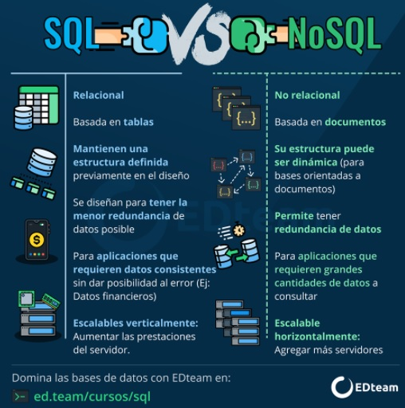

Exercício da semana 12 do programa de Back-end da Reprograma e Porto Digital. 

# BANCO DE DADOS 

## O QUE É BANCO DE DADOS? 

É a organização e armazenagem de informações sobre um domínio específico. De forma mais simples, é o agrupamento de dados que tratam do mesmo assunto, e que precisam ser armazenados para segurança, analises e ou transmissão futura. 

>Podemos exemplificar situações clássicas como uma lista telefônica, um catálogo de CDs ou um sistema de controle de RH de uma empresa.

Por último, temos que conceituar um sistema de banco de dados como o conjunto de quatro componentes básicos: dados, hardware, software e usuários. 

## QUAL É A IMPORTÂNCIA DE UM BANCO DE DADOS? 
Dados bem organizados melhoram a rotina da área de TI. Os profissionais conseguirão acessar, armazenar e restaurar os dados sempre que necessário com o uso de uma boa ferramenta de gestão de banco de dados.

## QUAIS SÃO AS VANTAGENS DE UM BANCO DE DADOS?
- Melhora a produtividade e da segurança das informações. 
- Aprimora a  tomada de decisão da gerência. 
- Fornecer um acompanhamento mensal dos resultados e indicadores da empresa. 
- Melhora a comunicação entre diversos setores da empresa. 
- Transferência das informações.
- Identificar gargalos do processo.

## QUAIS SÃO OS PRINCIPAIS TIPOS DE BANCO DE DADOS? 
Existem vários bancos de dados no mercado. Tem o vermelho, o azul, o laranja. Mas antes de falar sobre isso, vamos entender a diferença entre **_banco relacional_** e **_não relacional_**. 

>### BANCO RELACIONAL
É um tipo de banco de dados que armazena e fornece acesso a pontos de dados relacionados entre si, baseados no modelo relacional, com representação dos dados de forma de tabelas. Onde cada linha é um registro com uma ID exclusiva chamada chave. E cada coluna tem um atributo, onde temos um valor para cada atributo, facilitando o estabelecimento das relações entre os pontos de dados. 
A linguagem utilizada nesse formato é de **SQL** (Structured Query Language). 
São estruturados e garantem a entrega dos dados, portanto são perfeitos para aplicações como CRMs e empresas financeiras. 

>### BANCO NÃO RELACIONAL
É um tipo de banco de dados que não usa o esquema de tabela de linhas e colunas encontrado na maioria dos sistemas de banco de dados tradicionais. Em vez disso,  usam um modelo de armazenamento desestruturado. Por exemplo,pares chave/valor simples, JSON, mapas ou gráfico.
Suas soluções são baseadas em armazenamento na nuvem. A linguagem utilizada nesse formato é **NoSQL**(Not Only SQL), comumente utilizado por pessoas que produzem conteúdos por dispositivos, redes sociais e outros tipos de funcionalidades web, que exigem a gestão de dados em diferentes formatos.

### QUADRO SQL VERSUS NoSQL

### SISTEMAS DE GERENCIAMENTO DE BANCO DE DADOS (SGDBs)

- **MySQL**: Banco de dados relacional que pertence à Oracle (Open Source). 
- **PostgreSQL**: Gerenciador de banco de dados relacional Open Source, comumente utilizado para sistemas online, como Skype, Apple e o Metrô de São Paulo.
- **SQL Server**: Sistema desenvolvido pela Sybase em parceria com a Microsoft, trabalha com linguagem SQL.
- **MongoDB**: é um dos maiores destaques do mercado. Esse banco de dados é Open Source e é um dos mais utilizados por diversas empresas. Seu sistema gira em Windows, Linux e OSX, com linguagem de programação C++.
- **Redis**: tornou um banco de dados popular no mercado, e também funciona como Open Source. Através desse sistema, as informações são armazenadas no formato de chave-valor.

### REFERÊNCIAS 
1. _https://www.cin.ufpe.br/~dtmm/GDI/Apostilas/banco_dados.pdf_
2. _https://www.oracle.com/br/database/what-is-a-relational-database/_
3. _https://king.host/wiki/artigo/sql-server-mssql/_
4. _https://marquesfernandes.com/tecnologia/banco-de-dados-relacional-sql-e-nao-relacional-nosql-o-que-sao-para-que-servem-e-qual-a-diferenca/_

### EXTRA
- MODELOS ENTIDADE RELACIONAMENTO
_https://www.ime.usp.br/~andrers/aulas/bd2005-1/aula7.html_

